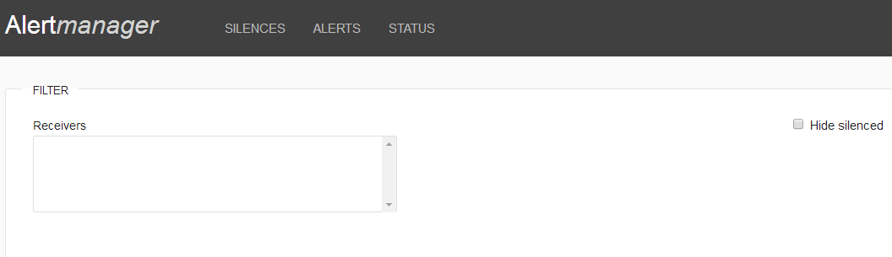
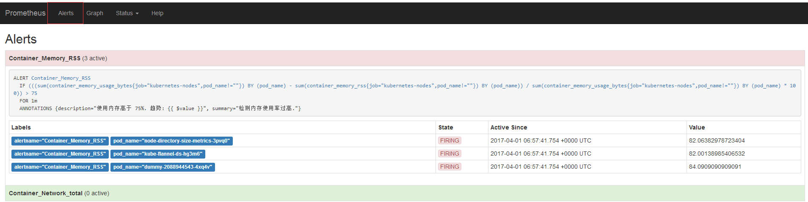
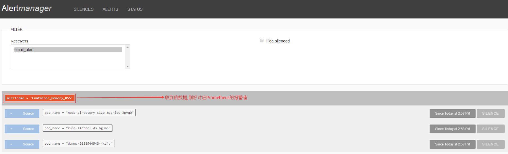

# 搭建Alertmanager服务

## 什么是Alertmanager?

Alertmanager主要处理由类似Prometheus服务器等客户端发来的警报，之后需要删除重复、分组，并将它们通过路由发送到正确的接收器，比如电子邮件、Slack等。

Alertmanager与Prometheus是相互分离的两个部分。Prometheus服务器根据报警规则将警报发送给Alertmanager，然后Alertmanager将silencing、inhibition、aggregation等消息通过电子邮件、PaperDuty和HipChat发送通知。

## 下载Alertmanager文件
注意：本示例用的`Alertmanager yaml`文件均是在本地测试环境使用的，请自行修改配置文件。
``` bash
# mkdir alertmanger && cd alertmanger
# wget https://raw.githubusercontent.com/Donyintao/Prometheus/master/alertmanager-deployment.yaml
# wget https://raw.githubusercontent.com/Donyintao/Prometheus/master/alertmanager-configmap.yaml
# wget https://raw.githubusercontent.com/Donyintao/Prometheus/master/alertmanager-ingress.yaml
```

## 安装Alertmanager服务

``` bash
# kubectl apply -f .
configmap "alertmanager" created
deployment "alertmanager" created
service "alertmanager" created
ingress "alertmanager" created

# kubectl get pod -n monitoring
NAME                             READY     STATUS    RESTARTS   AGE
alertmanager-1688473584-hzd51    1/1       Running   0          9d

# kubectl get ingress -n monitoring   
NAME           HOSTS                 ADDRESS        PORTS     AGE
alertmanager   alert.host.com        192.168.3.99   80        9d
```

## 验证Alertmanager服务
这时通过浏览器访问`http://alert.host.com `来访问`Alertmanager`的界面，查看的页面查看`FILTER`是空的，这是因为Prometheus还没有和Alertmanager建立联系。


## Prometheus rules配置

设置警报和通知的主要步骤流程(其实就简单三步，但是写的话，总感觉很复杂的样子)：
+ 安装配置Alertmanager
+ 在Prometheus中创建告警规则
+ 配置Prometheus通过-alertmanager.url标志与Alertmanager通信

使用ConfigMap方式，创建Prometheus rules文件。

# vim prometheus-rules-configmap.yaml
apiVersion: v1
kind: ConfigMap
metadata:
  creationTimestamp: null
  name: prometheus-rules
  namespace: monitoring
data:
  prometheus.rules: |
    ALERT Container_Memory_RSS
      IF ((sum(container_memory_rss{job="kubernetes-cadvisor",pod_name!=""}) by (pod_name)) /(sum(container_spec_memory_limit_bytes{job="kubernetes-cadvisor",pod_name!=""}) by (pod_name)) * 100) > 95
      FOR 1m
      LABELS { severity = "剩余内存: {{ $value }}" }
      ANNOTATIONS {
        summary = "检测内存使用率过高.",
        description = "使用内存高于 95%. 使用内存: {{ $value }}"
      }
 
    ALERT Container_Network_RX_Average
      IF ((sum (rate (container_network_receive_bytes_total{job="kubernetes-nodes",pod_name!=""}[1m])) by (pod_name)) / 1024) > 102400
      FOR 1m
      LABELS { severity = "RX带宽使用率: {{ $value }}" }
      ANNOTATIONS {
        summary = "检测网络带宽使用率过高.",
        description = "网络带宽使用高于 100M. RX带宽使用率: {{ $value }}"
      }
       
    ALERT Container_Network_TX_Average
      IF ((sum (rate (container_network_transmit_bytes_total{job="kubernetes-nodes",pod_name!=""}[1m])) by (pod_name)) / 1024) > 102400
      FOR 1m
      LABELS { severity = "TX带宽使用率: {{ $value }}" }
      ANNOTATIONS {
        summary = "检测网络带宽使用率过高.",
        description = "网络带宽使用高于 100M. TX带宽使用率: {{ $value }}"
      }  
 
    ALERT Container_USAGE_CPU_Average
      IF ((sum(rate(container_cpu_usage_seconds_total{job="kubernetes-nodes",image!="",pod_name!=""}[1m])) BY (pod_name)) * 100) > 95
      FOR 1m
      FOR 1m
      LABELS { severity = "CPU使用率: {{ $value }}" }
      ANNOTATIONS {
        summary = "检测CPU使用率过高.",
        description = "CPU使用高于 95%. CPU使用率: {{ $value }}"
      }
      
# kubectl apply -f prometheus-rules-configmap.yaml 
configmap "prometheus-rules" created
```

修改`prometheus-configmap.yaml`文件，在`global`配置下增加两行内容：

``` bash
rule_files:
  - '/etc/prometheus-rules/*.rules'
```

修改`prometheus-deployment.yaml`文件，在`containers.args`配置下增加`Alertmanager url`地址，用于发送报警规则。

``` bash
containers:
  args:
    - '-alertmanager.url=http://alertmanager'
```

修改`prometheus-deployment.yaml`文件，在`containers`配置下增加rules-volume挂载，用于存储报警规则文件。

``` bash
containers:
  - name: rules-volume
    mountPath: /etc/prometheus-rules
- name: rules-volume
  configMap:
    name: prometheus-rules       
```

## 重新加载Prometheus服务

``` bash
# kubectl apply -f prometheus-configmap.yaml  -f prometheus-deployment.yaml                           
configmap "prometheus" configured                  
deployment "prometheus" configured
service "prometheus" configured
```

## 验证Prometheus报警规则

这时通过浏览器访问`http://prometheus.host.com `来访问`Alert`的界面，会发现已经有新生成的报警规则；绿色表示：正常，红色表示：异常。


再次通过浏览器访问`http://alert.host.com `来访问`Alertmanager`的界面，查看的页面查看`FILTER`已经有数据了，这是因为Prometheus已经和Alertmanager建立联系。

