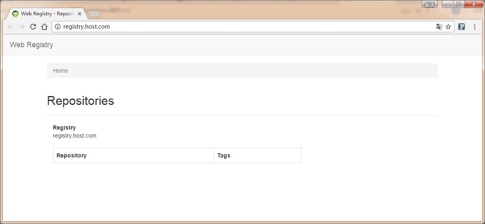

#搭建Docker私有仓库

## 为什么要使用Docker私有仓库？
使用私有仓库有许多优点： 
+ 节省网络带宽，针对于每个镜像不用每个人都去中央仓库上面去下载，只需要从私有仓库中下载即可；
+ 提供镜像资源利用，针对于公司内部使用的镜像，推送到本地的私有仓库中，以供公司内部相关人员使用。

## 安装Docker Registry
推荐使用Docker-compose管理工具：
+ Docker-compose是一个非常有用的Docker运行，管理的工具。
+ 可以通过定义compose文件，使用简单的一条命令同时起多个Docker Container运行不同的服务。
+ Docker-compose对于开发，测试，环境保存以及CI都提供了非常大的便利。

## 安装Docker-compose
注意：在实际使用操作中使用pip安装的docker-compose可能在执行时还会报代码有bug；推荐直接从github中下载稳定的release版本安装。
``` bash
# curl -L https://github.com/docker/compose/releases/download/1.16.0/docker-compose-`uname -s`-`uname -m` > /usr/local/bin/docker-compose
# chmod +x /usr/local/bin/docker-compose
```

## 配置Registry Container和Registry UI

创建docker-registry目录

``` bash
# mkdir -p /usr/local/docker-registry && cd /usr/local/docker-registry
# mdkir -p ./registry/{data,conf}
```

创建配置文件`config-ui.yml`

``` bash
# vim ./registry/conf/config-ui.yml
registry:
  url: http://192.168.100.115:5000/v2/
  name: registry.host.com
  readonly: false
  auth:
    enabled: false
```
创建配置文件`config-srv.yml`

``` bash
# vim ./registry/conf/config-ui.yml
version: 0.1
storage:
  filesystem:
    rootdirectory: /var/lib/registry
  delete:
    enabled: true
http:
  addr: 0.0.0.0:5000
log:
  level: info
```  

## 配置Nginx反向代理

创建Nginx配置目录
``` bash
# mkdir ./nginx/conf
```

创建Nginx配置文件`registry.conf`

``` bash
vim ./nginx/conf/registry.conf
upstream docker-registry {
    server 192.168.100.115:5000;
}

upstream docker-registry-ui {
    server 192.168.100.115:8080;
}

server {
    listen 80;
    listen 443 ssl;
    server_name registry.host.com;

    # SSL
    ssl_certificate /etc/nginx/conf.d/server.pem;
    ssl_certificate_key /etc/nginx/conf.d/server-key.pem;

    client_max_body_size 0;

    chunked_transfer_encoding on;

    location / {
        proxy_pass                          http://docker-registry-ui;
        proxy_set_header  Host              $http_host;   # required for docker client's sake
        proxy_set_header  X-Real-IP         $remote_addr; # pass on real client's IP
        proxy_set_header  X-Forwarded-For   $proxy_add_x_forwarded_for;
        proxy_set_header  X-Forwarded-Proto $scheme;
        proxy_read_timeout                  900;
    }

    location /v2/ {
        if ($http_user_agent ~ "^(docker\/1\.(3|4|5(?!\.[0-9]-dev))|Go ).*$" ) {
            return 404;
        }

        proxy_pass                          http://docker-registry;
        proxy_set_header  Host              $http_host;   # required for docker client's sake
        proxy_set_header  X-Real-IP         $remote_addr; # pass on real client's IP
        proxy_set_header  X-Forwarded-For   $proxy_add_x_forwarded_for;
        proxy_set_header  X-Forwarded-Proto $scheme;
        proxy_read_timeout                  900;
    }
}
```

创建Docker-compose配置文件`docker-compose.yml`

``` bash
# vim docker-compose.yml
nginx:
  image: nginx:1.10
  ports:
    - 192.168.100.115:80:80
    - 192.168.100.115:443:443
  links:
    - registry:registry
  volumes:
    - ./nginx/conf:/etc/nginx/conf.d
registry:
  image: registry:2.6
  ports:
    - 192.168.100.115:5000:5000
  environment:
    REGISTRY_STORAGE_FILESYSTEM_ROOTDIRECTORY: /data
  volumes:
    - ./registry/data:/data
    - ./registry/conf/config-srv.yml:/etc/docker/registry/config.yml:ro
registry-ui:
  image: hyper/docker-registry-web
  ports:
    - 192.168.100.115:8080:8080
  volumes:
    - ./registry/conf/config-ui.yml:/conf/config.yml:ro
```

## 创建Nginx服务使用的TLS证书

创建CA(Certificate Authority)

``` bash
# mkdir -p /tmp/ssl && cd /tmp/ssl
# cfssl print-defaults config > ca-config.json
# cat ca-config.json
{
  "signing": {
    "default": {
      "expiry": "87600h"
    },
    "profiles": {
      "kubernetes": {
        "usages": [
            "signing",
            "key encipherment",
            "server auth",
            "client auth"
        ],
        "expiry": "87600h"
      }
    }
  }
}
```
# cfssl print-defaults csr > ca-csr.json 
# cat ca-csr.json 
{
  "CN": "kubernetes",
  "key": {
    "algo": "rsa",
    "size": 2048
  },
  "names": [
    {
      "C": "CN",
      "ST": "BeiJing",
      "L": "BeiJing",
      "O": "k8s",
      "OU": "System"
    }
  ]
}

# cfssl gencert -initca ca-csr.json | cfssljson -bare ca
```

创建`docker-registry`证书签名请求

``` bash
cat > docker-registry-csr.json <<EOF
{
  "CN": "docker",
  "hosts": [
    "127.0.0.1",
    "192.168.100.115",
    "registry.host.com",
  ],
  "key": {
    "algo": "rsa",
    "size": 2048
  },
  "names": [
    {
      "C": "CN",
      "ST": "BeiJing",
      "L": "BeiJing",
      "O": "k8s",
      "OU": "System"
    }
  ]
}
EOF
```
生成`docker-registry`证书和私钥

``` bash
cfssl gencert -ca=ca.pem \
              -ca-key=ca-key.pem \
              -config=ca-config.json \
              -profile=kubernetes docker-registry-csr.json | cfssljson -bare server
```

## 分发证书

将`TLS`证书拷贝到`Nginx`的配置目录
``` bash
# cp -r /tmp/ssl/server*.pem /usr/local/docker-registry/nginx/conf
```

## 运行Registry Container并使用Nginx做代理 

``` bash
# docker-compose up -d    
Starting docker_registry-ui_1 ... 
Starting docker_registry_1 ... 
Starting docker_registry_1
Starting docker_registry_1 ... done
Starting docker_nginx_1 ... 
Starting docker_nginx_1 ... done
```
## 验证Registry Container服务是否正常启动

注意：确定docker容器都正常运行后，用curl命令验证功能是否正常运行。使得`IP:5000`和`IP:443`访问registry都应该返回`{}`。 

``` bash
# curl https://192.168.100.115:443/v2/ -k
{}
# curl http://192.168.100.115:5000/v2/ -k    
{}
```
这时我们用浏览器访问`http://registry.host.com`来访问`Web Registry`的界面会显示正常；如果出现异常，请检查网络和防火墙配置。

