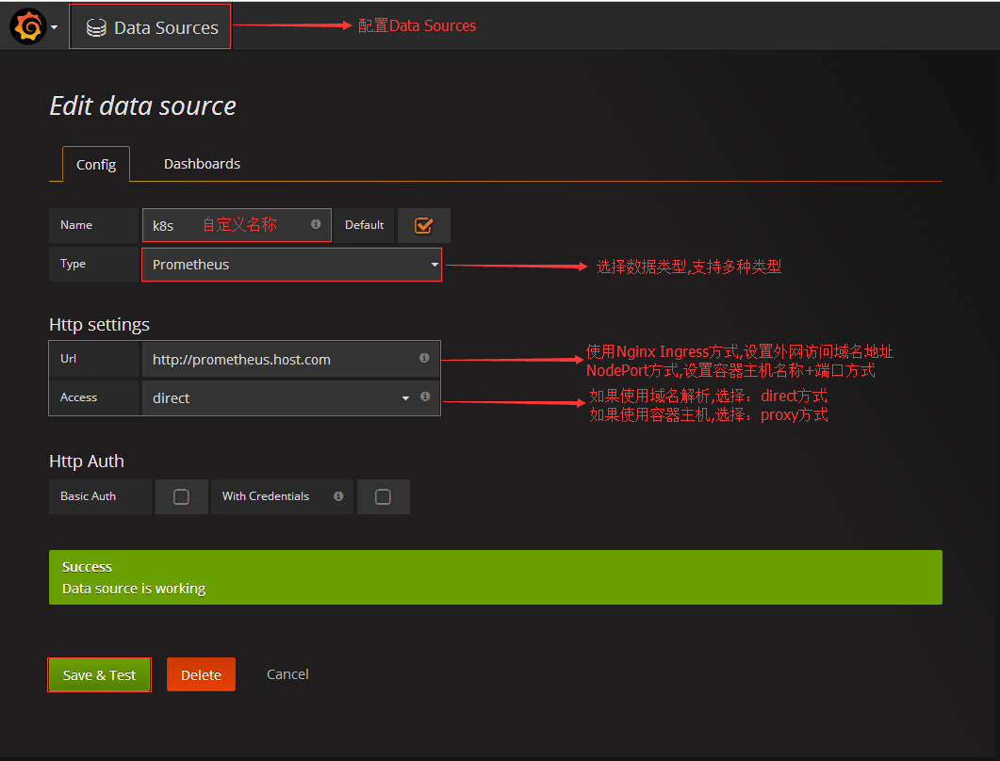
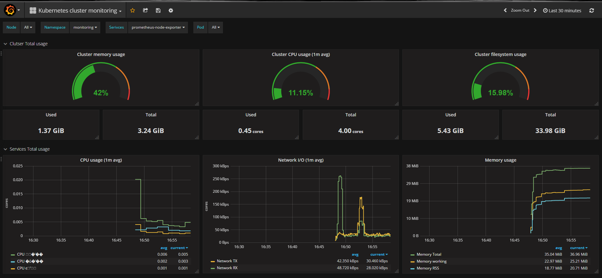

# 搭建Grafana服务

## 什么是Grafana?

Grafana是一个开源的指标量监测和可视化工具。常用于展示基础设施的时序数据和应用程序运行分析。Grafana是根据查询条件设置聚合规则，在合适的图表上进行展示，多个图表共同组建成一个dashboard，如果熟悉kibana服务的话应该非常容易上手。值得一提的是Grafana的可视化功能非常强大。

## 下载Grafana文件
注意：本示例用的`prometheus yaml`文件均是在本地测试环境使用的，请自行修改配置文件。
``` bash
# mkdir grafana && cd Grafana
# wget https://raw.githubusercontent.com/Donyintao/Prometheus/master/grafana-ingress.yaml
# wget https://raw.githubusercontent.com/Donyintao/Prometheus/master/grafana-deployment.yaml
```

## 安装Grafana服务

``` bash
# kubectl apply -f grafana-deployment.yaml -f grafana-ingress.yaml 
deployment "grafana-core" created
service "grafana" created
ingress "grafana" created

# kubectl get pod -n monitoring
NAME                             READY     STATUS    RESTARTS   AGE
grafana-core-542852455-0lgp3     1/1       Running   0          10d

# kubectl get ingress -n monitoring   
NAME           HOSTS                 ADDRESS        PORTS     AGE
grafana        grafana.host.com      192.168.3.99   80        10d
```

## 配置Grafana服务

Grafana是一个度量仪表盘和图形编辑器的工具，主要通过dashboard配置和展示数据信息。

用浏览器访问`http://grafana.host.com`来登录`Grafana`服务，默认账号：`admin`默认密码：`admin`

添加数据源，Grafana支持多种数据源。


导入Kubernetes监控模板，Grafana服务本身提供多种监控模板。[Grafana服务监控模板](https://grafana.com/dashboards)

