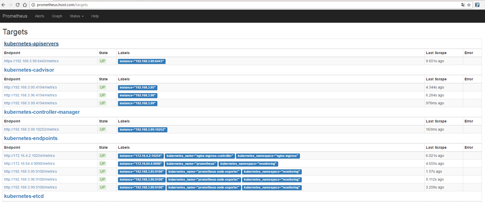

# Kubernetes 监控服务

## 什么是Prometheus?

Prometheus是由SoundCloud开源监控告警解决方案, 从2012年开始编写代码, 再到2015年github上开源以来, 已经吸引了9k+关, 以及很多大公司的使用; 2016年Prometheus成为继k8s后, 第二名CNCF(Cloud Native Computing Foundation)成员。

## 主要功能

- 多维数据模型(时序由 metric名字和k/v的labels构成)。
- 灵活的查询语句(PromQL)。
- 无依赖存储, 支持local和remote不同模型。
- 采用http协议, 使用pull模式, 拉取数据, 简单易懂。
- 监控目标, 可以采用服务发现或静态配置的方式。
- 支持多种统计数据模型, 图形化友好。

## 基础架构


## 下载Prometheus文件
注意：本示例用的`prometheus yaml`文件均是在本地测试环境使用的，请自行修改配置文件。
``` bash
# mkdir prometheus && cd prometheus
# wget https://raw.githubusercontent.com/Donyintao/Prometheus/master/prometheus-ingress.yaml
# wget https://raw.githubusercontent.com/Donyintao/Prometheus/master/prometheus-deployment.yaml
# wget https://raw.githubusercontent.com/Donyintao/Prometheus/master/prometheus-cluster-rbac.yaml
# wget https://raw.githubusercontent.com/Donyintao/Prometheus/master/prometheus-node-exporter.yaml
# wget https://raw.githubusercontent.com/Donyintao/Prometheus/master/prometheus-configmap.yaml
```

## 创建Prometheus Namespace

``` bash
# kubectl create ns monitoring
namespace "monitoring" created
```

## 安装Prometheus服务

``` bash
# kubectl apply -f .
clusterrolebinding "prometheus" created
clusterrole "prometheus" created
serviceaccount "prometheus" created
configmap "prometheus" created
deployment "prometheus" created
service "prometheus" created
ingress "prometheus" created
daemonset "prometheus-node-exporter" created
service "prometheus-node-exporter" created

# kubectl get pod -n monitoring
NAME                             READY     STATUS    RESTARTS   AGE
prometheus-3754254186-l8q56      1/1       Running   7          9d
prometheus-node-exporter-j3sck   1/1       Running   0          9d
prometheus-node-exporter-k83gr   1/1       Running   0          9d
prometheus-node-exporter-llr1w   1/1       Running   0          9d

# kubectl get ingress -n monitoring   
NAME           HOSTS                 ADDRESS        PORTS     AGE
prometheus     prometheus.host.com   192.168.3.99   80        9d
```

## 验证Prometheus服务

这时我们用浏览器访问`http://prometheus.host.com`来访问Prometheus的界面，查看已经搜集到的数据和Targets状态。



## 总结

通过向Kubernetes集群内部署Prometheus，我们在不修改任何集群配置的状态下，利用Prometheus 的服务发现功能获得了基本的集群监控能力，并通过web界面对监控系统获取到的数据做了基本的查询。
后面我们将进一步完善Prometheus的使用：
+ 增加更多的监控数据源
+ 使用Grafana图形化的展示搜集到的监控数据
+ 使用AlertManager实现异常提醒
