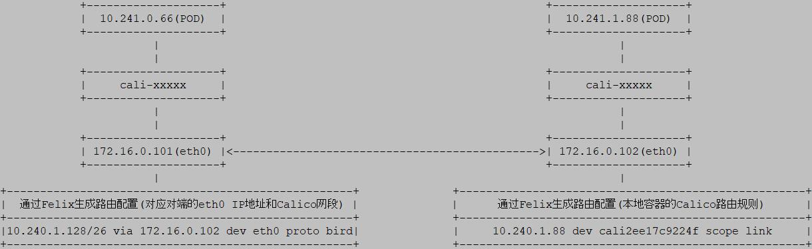

# 部署Calico服务

## 什么是Calico？
`Calico`是一个纯三层的方案，为虚机及容器提供多主机间通信，没有使用Overlay Network驱动，采用虚拟路由代替虚拟交换，每一台虚拟路由器通过BGP协议传播可达信息（路由）到其他虚拟或物理路由器。

## Calico网络模型

### IPIP模式
从字面来理解，就是把一个IP数据包又套在一个IP包里，即把IP层封装到IP层的一个tunnel，看起来似乎是浪费，实则不然。它的作用其实基本上就相当于一个基于IP层的网桥！一般来说，普通的网桥是基于mac层的，根本不需IP，而这个IPIP 则是通过两端的路由做一个tunnel，把两个本来不通的网络通过点对点连接起来。

### BGP模式
边界网关协议(Border Gateway Protocol, BGP)是互联网上一个核心的去中心化自治路由协议。它通过维护IP路由表或‘前缀’表来实现自治系统（AS）之间的可达性，属于矢量路由协议。BGP不使用传统的内部网关协议(IGP)的指标，而使用基于路径、网络策略或规则集来决定路由。因此，它更适合被称为矢量性协议，而不是路由协议。BGP，通俗的讲就是讲接入到机房的多条线路(如电信、联通、移动等)融合为一体，实现多线单IP，BGP 机房的优点：服务器只需要设置一个IP地址，最佳访问路由是由网络上的骨干路由器根据路由跳数与其它技术指标来确定的，不会占用服务器的任何系统。

## Calico工作流程



## Installing Calico

说明: Calico使用Deployment方式安装，需要在Kubernetes集群运行正常后，再执行部署操作

``` bash
# mkdir -p /tmp/calico && cd /tmp/calico
# wget https://docs.projectcalico.org/v3.4/getting-started/kubernetes/installation/hosted/calico.yaml
# cp calico.yaml calico.yaml.bak
# diff calico.yaml.bak calico.yaml
16c16
<   etcd_endpoints: "http://10.96.232.136:6666"
---
>   etcd_endpoints: "http://172.16.0.101:2379,http://172.16.0.102:2379,http://172.16.0.103:2379"
216c216
<               value: "Always"
---
>               value: "CrossSubnet"
227c227
<               value: "192.168.0.0/16"
---
>               value: "10.240.0.0/16"
# kubectl apply -f calico.yaml
```

### Installing calicoctl

``` bash
# curl -O -L  https://github.com/projectcalico/calicoctl/releases/download/v3.4.0/calicoctl
# chmod +x calicoctl
# mkdir -p /etc/calico 
# vim /etc/calico/calicoctl.cfg
apiVersion: projectcalico.org/v3
kind: CalicoAPIConfig
metadata:
spec:
  datastoreType: "etcdv3"
  etcdEndpoints: "http://172.16.0.101:2379,http://172.16.0.102:2379,http://172.16.0.103:2379"
```

### 验证

``` bash
# calicoctl get ipPool -o wide
NAME                  CIDR            NAT    IPIPMODE      DISABLED   
default-ipv4-ippool   10.240.0.0/16   true   CrossSubnet   false
```