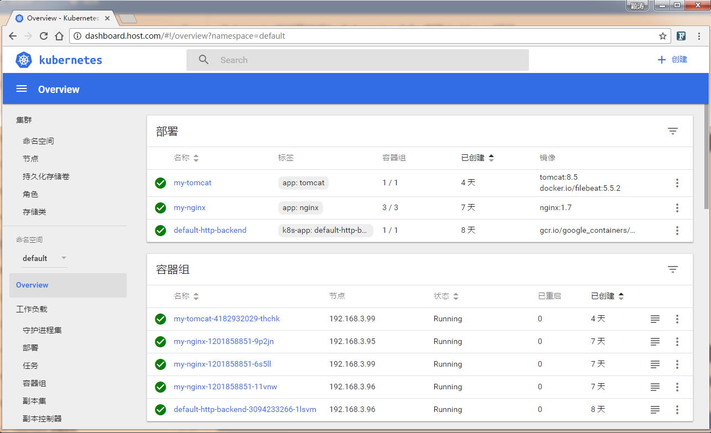

# 部署Dashboard插件
## Dashboard作用
Dashboard是Kubernetes的一个插件，代码在单独的开源项目里；是官方提供的用户管理Kubernets集群可视化工具。

## 下载Dashboard插件

``` bash
# mkdir -p dashboard && cd dashboard
# wget https://raw.githubusercontent.com/kubernetes/kubernetes/master/cluster/addons/dashboard/dashboard-service.yaml
# wget https://raw.githubusercontent.com/kubernetes/kubernetes/master/cluster/addons/dashboard/dashboard-controller.yaml
```

## 配置dashboard-deployment服务

注意：官方源码默认没有定义授权ServiceaAcount, 所以dashboard-deployment服务需要指定ServiceaAcount.

``` bash
# diff dashboard-controller.yaml dashboard-controller.yaml.bak
21d20
<       serviceAccountName: kubernetes-dashboard
```

## 创建Dashboard RBAC认证

注意：由于kube-apiserver启用了RBAC授权, 而官方源码的dashboard并没有定义授权ServiceAccount, 所以后续访问kube-apiserver的API时会被拒绝.

``` bash
# vim dashboard-rbac.yaml
apiVersion: v1
kind: ServiceAccount
metadata:
  labels:
    k8s-app: kubernetes-dashboard
  name: kubernetes-dashboard
  namespace: kube-system
---
apiVersion: rbac.authorization.k8s.io/v1beta1
kind: ClusterRoleBinding
metadata:
  name: kubernetes-dashboard
  labels:
    k8s-app: kubernetes-dashboard
roleRef:
  apiGroup: rbac.authorization.k8s.io
  kind: ClusterRole
  name: cluster-admin
subjects:
- kind: ServiceAccount
  name: kubernetes-dashboard
  namespace: kube-system
```  

## 创建Dashboard Ingress服务

注意：Kubernetes提供了NodePort、LoadBalancer、Ingress三种方式。
注意：本示例采用了Ingress方式，参考：[部署Nginx-Ingress服务](https://github.com/Donyintao/nginx-ingress)

``` bash
# vim dashboard-ingress.yaml
apiVersion: extensions/v1beta1
kind: Ingress
metadata:
  name: kubernetes-dashboard
  namespace: kube-system
  labels:
    k8s-app: kubernetes-dashboard
spec:
  rules:
  - host: dashboard.host.com
    http:
      paths:
      - path: /
        backend:
          # 与Service Port保持一致
          servicePort: 80
          # 与Service服务名称保持一致
          serviceName: kubernetes-dashboard
```
          
## 安装dashboard服务

``` bash
# kubectl apply -f .
deployment "kubernetes-dashboard" created
ingress "kubernetes-dashboard" created
serviceaccount "kubernetes-dashboard" created
clusterrolebinding "kubernetes-dashboard" created
service "kubernetes-dashboard" created
 
# kubectl get pod -n kube-system
NAME                                   READY     STATUS    RESTARTS   AGE
kube-dns-3587985970-n1fc3              3/3       Running   0          3h
kubernetes-dashboard-921590658-frx1n   1/1       Running   0          2m
 
# kubectl get ingress -n kube-system
NAME                   HOSTS                ADDRESS        PORTS     AGE
kubernetes-dashboard   dashboard.host.com   192.168.3.99   80        55s
```
## 验证Dashboard服务

正常情况，可以通过浏览器访问域名，本示例域名：`http://dashboard.host.com`


